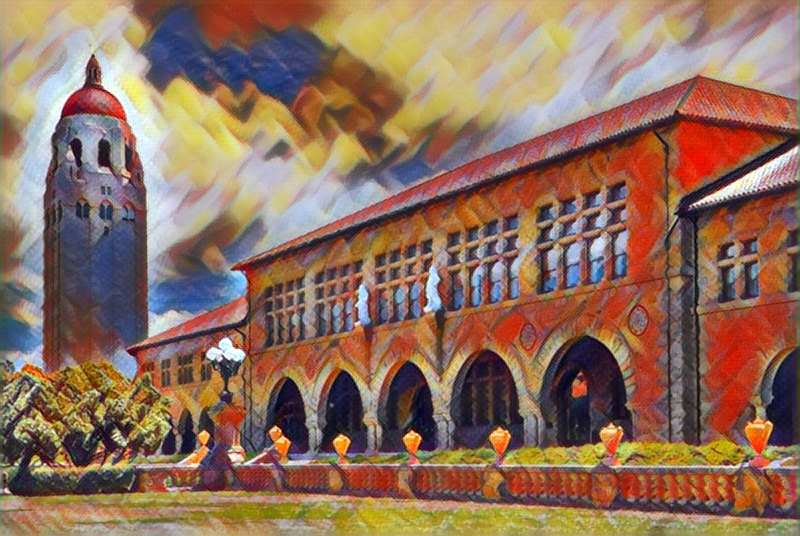
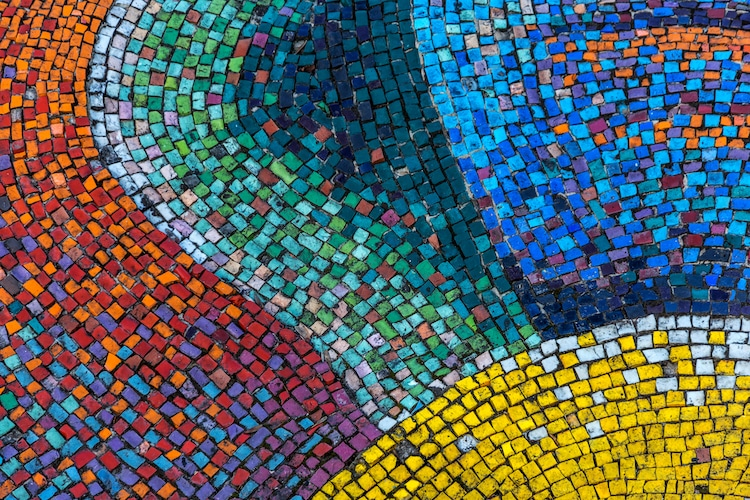
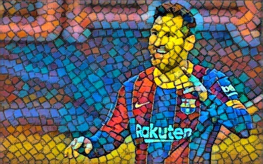
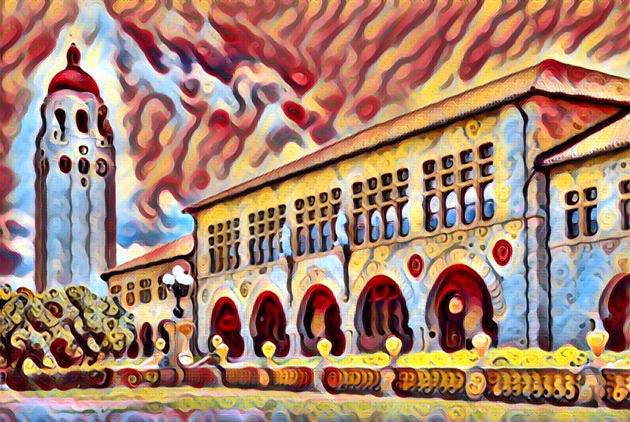

# Fast Neural Style Transfer using PyTorch

This is an implementation of fast neural style in pytorch which follows the approach of the paper [**Perceptual Losses for Real-Time Style Transfer and Super-Resolution by 
Justin Johnson, Alexandre Alahi, Li Fei-Fei**](https://arxiv.org/abs/1603.08155). 
Also it follows the exact model architecture as detailed in the [**supplementary paper**](https://cs.stanford.edu/people/jcjohns/papers/fast-style/fast-style-supp.pdf)

[**The caffe pretrained weights**](https://github.com/jcjohnson/pytorch-vgg) of vgg16 is used here instead of Pytorch's default pretrained vgg16.

<h2> Examples </h2>

 

 

